#  邮票
## 中国
2010年
+ 1月5日 庚寅年 特种 元  

+ 1月8日 宋任穷同志诞生一百周年 纪念 元  

+ 1月21日 上海世博园 特种 元  

+ 2月6日 梁平木版年画 特种 元  

+ 1月1日 中国芭蕾——红色娘子军 特种 元  

+ 3月8日 “三八”国际劳动妇女节一百周年 纪念 元  

+ 3月20日 富春山居图 特种 元  

+ 4月5日 清明节 特种 元  

+ 4月18日 成语典故（二） 特种 元  

+ 5月1日 中国2010年上海世博会开幕纪念 纪念 元  

+ 5月15日 中国古代书法－行书 特种 元  

+ 6月1日 文彦博灌水浮球 特种 元  

+ 6月5日 节能减排 保护环境 特种 元  

+ 6月12日 昆曲 特种 元  

+ 5月25日 第十届世界旅游旅行大会 纪念 元  

+ 6月28日 珠江风韵·广州 特种 元  

+ 7月3日 楼兰故城遗址 特种 元  

+ 7月11日 中国航海日 纪念 元  

+ 7月25日 外国音乐家 纪念 元  

+ 8月16日（七夕节） 民间传说——牛郎织女 特种 元  

+ 9月3日 广州2010年亚洲残疾人运动会 纪念 元  

+ 9月28日 孔庙、孔府、孔林 特种 元  

+ 9月13日 香格里拉 特种 元  

+ 10月14日 新中国治淮六十周年 纪念 元  

+ 10月18日 梅兰竹菊 特种 元  

+ 10月22日 朱熹诞生八百八十周年 纪念 元  

+ 11月12日 第16届亚洲运动会开幕纪念 纪念 元  

+ 11月20日 中医药堂 特种 元  

+ 12月7日 中国高速铁路 特种 元  

+ 12月12日 中国资本市场 特种 元  

2011年
+ 1月5日 辛卯年 特种 元  

+ 1月10日 凤翔木版年画 特种 元  

+ 2月21日 中国共产党早期领导人（三） 纪念 元  

+ 3月8日 良渚玉器 特种 元  

+ 3月21日 中国古典文学名著——<儒林外史> 特种 元  

+ 4月15日 中国古代书法——草书 特种 元  

+ 4月23日 世界读书日 纪念 元  

+ 4月24日 清华大学建校一百周年 纪念 元  

+ 4月17日 中国飞机（二） 特种 元  

+ 4月28日 2011西安世界园艺博览会 纪念 元  

+ 5月4日 深圳第26届世界大学生夏季运动会 纪念 元  

+ 5月10日 云锦 特种 元  

+ 5月23日 西藏和平解放六十周年 纪念 元  

+ 5月25日 中国现代科学家（五） 纪念 元  

+ 6月20日 明清家具——坐具 特种 元  

+ 6月22日 中国共产党成立九十周年 纪念 元  

+ 6月30日 京沪高速铁路通车纪念 纪念 元  

+ 7月8日 中国曲艺 特种 元  

+ 7月2日 自行车运动 特种 元  

+ 7月10日 海外中华情 特种 元  

+ 8月8日 中国远洋运输 特种 元  

+ 9月10日 少数民族传统体育（二） 特种 元  

+ 9月12日 关公 特种 元  

+ 10月10日 辛亥革命一百周年 纪念 元  

+ 9月26日 八十七神仙卷（局部） 特种 元  

+ 10月13日 美好新家园 特种 元  

+ 10月21日 天津滨海新区 特种 元  

+ 11月7日 新华通讯社建社八十周年 纪念 元  

+ 11月11日 第27届亚洲国际集邮展览 纪念 元  

+ 12月10日 古代天文仪器 特种 元  

2012年
+ 1月5日 壬辰年 特种 元  

+ 2月5日 中国银行 特种 元  

+ 2月23日 中华书局 特种 元  

+ 3月20日 太平鸟与和平鸽 特种 元  

+ 4月1日 亚洲-太平洋邮政联盟成立五十周年 纪念 元  

+ 4月15日 中国现代音乐家（一） 纪念 元  

+ 4月27日 福禄寿喜 特种 元  

+ 5月4日 中国共产主义青年团成立九十周年 纪念 元  

+ 5月12日 国际护士节一百周年 纪念 元  

+ 5月20日 南京大学建校一百一十周年 纪念 元  

+ 5月23日 <在延安文艺座谈会上的讲话>发表七十周年 纪念 元  

+ 6月9日 明清家具——承具 特种 元  

+ 6月16日 海阳2012第三届亚洲沙滩运动会 纪念 元  

+ 6月30日 红色足迹 特种 元  

+ 7月1日 城乡居民社会养老保险制度全覆盖 纪念 元  

+ 7月8日 国家博物馆 特种 元  

+ 7月27日 第三十届奥林匹克运动会 纪念 元  

+ 8月1日 人民军队早期将领（三） 纪念 元  

+ 8月1日 丝绸之路 特种 元  

+ 8月23日 民间传说——刘三姐 特种 元  

+ 8月28日 和田玉 特种 元  

+ 9月26日 三星堆青铜器 特种 元  

+ 8月31日 宋词 特种 元  

+ 9月3日 延边风情 特种 元  

+ 9月13日 里耶秦简 特种 元  

+ 10月20日 中国陶瓷——德化窑瓷器 特种 元  

+ 10月26日 招商局 特种 元  

+ 11月8日 中国共产党第十八次全国代表大会 纪念 元  

+ 11月26日 泰州长江公路大桥与伊斯坦布尔博斯普鲁斯海峡大桥 特种 元  

+ 11月30日 中国审计 特种 元  

+ 12月1日 孔子学院 特种 元  

+ 12月4日 现行宪法公布施行三十周年 纪念 元  

2013年
+ 1月5日 癸巳年 特种 元  

+ 1月18日 海洋石油 特种 元  

+ 3月5日 毛泽东“向雷锋同志学习”题词发表50周年 纪念 元  

+ 3月5日 中华人民共和国第12届全国人民代表大会 纪念 元  

+ 3月13日 中共中央党校建校80周年 纪念 元  

+ 3月16日 桃花 特种 元  

+ 3月22日 世界水日 纪念 元  

+ 4月13日 捣练图 特种 元  

+ 4月21日 景泰蓝 特种 元  

+ 4月25日 中华全国集邮联合会第七次代表大会 纪念 元  

· 特8-2013：5月3日特别 齐心协力 抗震救灾  元  

+ 5月11日 感恩母亲 特种 元  

+ 5月19日 中国古镇（一） 特种 元  

+ 6月1日 小蝌蚪找妈妈 特种 元  

+ 6月16日 金铜佛造像 特种 元  

+ 7月13日 琴棋书画 特种 元  

+ 7月27日 龙虎山 特种 元  

+ 8月18日 猫 特种 元  

+ 8月15日 中国—东盟博览会 特种 元  

+ 8月31日 中华人民共和国第十二届运动会 纪念 元  

+ 9月2日 韦国清同志诞生一百周年 纪念 元  

+ 9月7日 豫园 特种 元  

+ 9月7日 南华寺 特种 元  

+ 9月15日 中国古代文学家（三） 纪念 元  

+ 9月27日 乒乓球运动 特种 元  

+ 9月29日 中国梦—国家富强 特种 元  

+ 10月11日 第十届中国艺术节 纪念 元  

+ 10月15日 习仲勋同志诞生一百周年 纪念 元  

+ 10月22日 世界审计组织第二十一届大会 纪念 元  

+ 10月25日 杂交水稻 特种 元  

+ 11月16日 毛泽东同志诞生一百二十周年 纪念 元  

+ 11月29日 武汉大学建校一百二十周年 纪念 元  

2014年
· 特9-2014： 1月1日特别 中国首次落月成功纪念  元  

+ 1月5日 甲午年 特种 元  

+ 2月23日 猛禽（二） 特种 元  

+ 1月27日 中法建交五十周年 纪念 元  

+ 3月1日 浴马图 特种 元  

+ 3月15日 保护消费者权益 特种 元  

+ 4月20日 网络生活 特种 元  

+ 4月25日 2014青岛世界园艺博览会 纪念 元  

+ 5月3日 中国人民对外友好协会成立六十周年 纪念邮票1套1枚
+ 5月10日 鸿雁传书 特种 元  

+ 5月18日 唐卡 特种 元  

+ 6月1日 动画-〈大闹天宫〉 特种 元  

+ 6月16日 纪念黄埔军校建校九十周年 纪念 元  

+ 6月21日 中国古典文学名著-〈红楼梦〉（一） 特种 元  

+ 7月6日 黄梅戏 特种 元  

+ 7月15日 水果（一） 特种 元  

+ 8月16日 第二届夏季青年奥林匹克运动会 纪念 元  

+ 8月22日 邓小平同志诞生一百一十周年 纪念 元  

+ 8月28日 诸葛亮 特种 元  

+ 9月10日 教师节 纪念 元  

+ 9月13日 长江 特种 元  

+ 9月15日 全国人民代表大会成立六十周年 纪念 元  

+ 9月20日 中国梦-民族振兴 特种 元  

+ 9月30日 中华孝道（一） 特种 元  

+ 10月7日 新疆生产建设兵团成立六十周年 纪念 元  

+ 10月16日 中国现代科学家（六） 纪念 元  

+ 11月10日 亚太经合组织第二十二次领导人非正式会议 纪念 元  

+ 11月11日 第十届中国国际航空航天博览会 纪念 元  

+ 11月20日 中国极地科学考察三十周年 纪念 元  

+ 12月1日 元曲 特种 元  

2015年
+ 1月5日 乙未年 特种 元  

+ 1月10日 拜年 特种 元  

+ 1月15日 遵义会议八十周年 纪念 元  

+ 2月4日 二十四节气（一） 特种 元  

+ 3月22日 挥扇仕女图 特种 元  

+ 4月4日 中国古代文学家（四） 纪念 元  

+ 4月18日 瘦西湖 特种 元  

+ 5月3日 中国古典文学名著——〈西游记〉(一) 特种 元  

+ 5月20日 世界计量日 纪念 元  

+ 6月3日 中国船舶工业 特种 元  

+ 6月5日 环境日 纪念 元  

+ 6月13日 感恩父亲 特种 元  

+ 7月1日 钱塘江大潮 特种 元  

+ 7月18日 清源山 特种 元  

+ 7月25日 中国梦——人民幸福 特种 元  

· 2015-特10：7月31日特别 北京申办2022年冬奥会成功纪念  元  

+ 8月8日 包公 特种 元  

+ 9月1日 西藏自治区成立五十周年 纪念 元  

+ 8月20日 鸳鸯 特种 元  

+ 8月23日 黄河 特种 元  

+ 9月3日 中国人民抗日战争暨世界反法西斯战争胜利七十周年 纪念 元  

+ 10月10日 故宫博物院 特种 元  

+ 9月17日 人工全合成结晶牛胰岛素五十周年 纪念 元  

+ 9月25日 第十届中国国际园林博览会 纪念 元  

+ 9月26日 联合国成立七十周年 纪念 元  

+ 10月1日 新疆维吾尔自治区成立六十周年 纪念 元  

+ 10月2日 天津大学建校一百二十周年 纪念 元  

+ 11月12日 诗词歌赋 特种 元  

+ 11月28日 中国首架喷气式支线客机交付运营 纪念 元  

+ 11月29日 图说我们的价值观 特种 元  

2016年
+ 1月5日 丙申年 特种 元  

+ 1月10日 拜年 特种 元  

+ 3月16日 刘海粟作品选 特种 元  

+ 3月20日 中国邮政开办一百二十周年 纪念 元  

+ 4月2日 高逸图 特种 元  

+ 4月8日 交通大学建校一百二十周年 纪念 元  

+ 4月13日 世界法医学奠基人——宋慈 纪念 元  

+ 4月23日 全民阅读 特种 元  

+ 4月29日 2016唐山世界园艺博览会 纪念 元  

+ 5月5日 二十四节气（二） 特种 元  

+ 5月8日 中国现代科学家（七） 纪念 元  

+ 5月19日 中国古镇（二） 特种 元  

+ 6月11日 文化遗产日 纪念 元  

+ 6月16日 上海迪士尼 特种 元  

+ 6月18日 中国古典文学名著-〈红楼梦〉（二） 特种 元  

+ 6月26日 正定隆兴寺 特种 元  

+ 7月13日 殷墟 特种 元  

+ 7月23日 水果（二） 特种 元  

+ 10月28日 中国灯塔 特种 元  

+ 8月5日 第三十一届奥林匹克运动会 纪念 元  

+ 8月9日 相思鸟 特种 元  

+ 8月20日 长城 特种 元  

+ 8月28日 月圆中秋 特种 元  

+ 9月4日 玄奘 特种 元  

+ 8月27日 2016年二十国集团杭州峰会 纪念 元  

+ 9月10日 海上丝绸之路 特种 元  

+ 9月11日 第39届国际标准化组织大会 纪念 元  

+ 9月28日 四川大学建校一百二十周年 纪念 元  

+ 10月7日 中华孝道（二） 特种 元  

+ 10月17日 扶贫日 纪念 元  

+ 10月22日 中国工农红军长征胜利八十周年 纪念 元  

+ 11月12日 孙中山诞生一百五十周年 纪念 元  

+ 12月2日 中国2016亚洲国际集邮展览 纪念 元  

2017年
+ 1月5日 丁酉年 特种 元  

+ 1月10日 拜年 特种 元  

+ 2月25日 千里江山图 特种 元  

+ 2月27日 商务印书馆 特种 元  

+ 3月9日 京津冀协同发展 特种 元  

+ 3月20日 春夏秋冬 特种 元  

+ 3月30日 中国古典文学名著——《西游记 （二） 特种 元  

+ 4月9日 红山文化玉器 特种 元  

+ 5月1日 内蒙古自治区成立七十周年 纪念 元  

+ 5月14日 “一带一路”国际合作高峰论坛 纪念 元  

+ 5月19日 中国恐龙 特种 元  

+ 5月21日 浙江大学建校一百二十周年 纪念 元  

+ 5月31日 儿童游戏（一） 特种 元  

+ 6月26日 国际禁毒日 纪念 元  

+ 7月1日 香港回归祖国二十周年 纪念 元  

+ 7月29日 凤（文物） 特种 元  

+ 8月1日 中国人民解放军建军九十周年 纪念 元  

+ 8月19日 金砖国家领导人厦门会晤 纪念 元  

+ 8月27日 中华人民共和国第十三届运动会 纪念 元  

+ 8月28日 喜鹊 特种 元  

+ 9月9日 外国音乐家（二） 纪念 元  

+ 9月17日 科技创新 纪念 元  

+ 9月20日 张骞 特种 元  

+ 10月15日 粤剧 特种 元  

+ 10月18日 中国共产党第十九次全国代表大会 纪念 元  

+ 11月8日 记者节 纪念 元  

+ 11月16日 沧州铁狮子与巴肯寺狮子 特种 元  

+ 11月25日 中国高速铁路发展成就 纪念 元  

+ 12月22日 河北雄安新区设立纪念 纪念 元  

+ 12月31日 北京2022年冬奥会会徽和冬残奥会会徽 纪念 元  

### 2018年
+ 1月5日 戊戌年 特种 元  

+ 1月10日 拜年 特种 元  

+ 1月24日 中国剪纸（一） 特种 元  

+ 3月2日 元宵节 特种 元  

+ 3月5日 中华人民共和国第十三届全国人民代表大会 纪念 元  

+ 3月25日 海棠花 特种 元  

+ 4月1日 中央美术学院建校一百周年 纪念 元  

+ 4月22日 中国古典文学名著-〈红楼梦〉（三） 特种 元  

+ 5月5日 马克思诞辰200周年 纪念 元  

+ 5月11日 当代美术作品选（二） 特种 元  

+ 5月19日 丝绸之路文物（一） 特种 元  

+ 5月20日 全国助残日 纪念 元  

+ 5月26日 中国古代科学家及著作（一） 纪念 元  

+ 6月9日 喀什风光 特种 元  

+ 6月18日 屈原 特种 元  

+ 6月9日 上海合作组织青岛峰会 纪念 元  

+ 6月24日 清正廉洁（一） 特种 元  

+ 7月14日 水果（三） 特种 元  

+ 7月29日 近代民族英雄 纪念 元  

+ 8月4日 四景山水图 特种 元  

+ 8月7日 二十四节气（三） 特种 元  

+ 8月17日 大雁 特种 元  

+ 8月26日 长江经济带 特种 元  

+ 9月8日 诗经 特种 元  

+ 9月15日 月圆中秋 特种 元  

+ 9月19日 宁夏回族自治区成立六十周年 纪念 元  

+ 9月23日 中国农民丰收节 纪念 元  

+ 10月1日 国际老年人日 纪念 元  

+ 10月18日 广西壮族自治区成立六十周年 纪念 元  

+ 11月5日 中国国际进口博览会 纪念 元  

+ 10月30日 港珠澳大桥 纪念 元  

+ 11月16日 北京2022年冬奥会——雪上运动 纪念 元  

+ 12月15日 两岸“三通”十周年 纪念 元  

+ 12月18日 改革开放四十周年 纪念 元  

2019年
+ 1月5日 己亥年 特种 元  

+ 1月10日 拜年 特种 元  

+ 2月8日 中葡建交四十周年 纪念 元  

+ 3月12日 中国植树节 纪念 元  

+ 3月31日 马拉松 特种 元  

+ 4月20日 中国古典文学名著——〈西游记〉（三） 特种 元  

+ 4月29日 2019年中国北京世界园艺博览会 纪念 元  

+ 5月4日 “五四”运动一百周年 纪念 元  

+ 5月11日 芍药 特种 元  

+ 5月19日 中国古镇（三） 特种 元  

+ 6月1日 儿童游戏（二） 特种 元  

+ 6月11日 中国2019世界集邮展览 纪念 元  

+ 6月15日 中欧班列（义乌—马德里） 特种 元  

+ 7月10日 第七届世界军人运动会 纪念 元  

+ 7月20日 鄱阳湖 特种 元  

+ 8月3日 五岳图 特种 元  

+ 8月6日 中国古代神话（二） 特种 元  

+ 8月10日 川藏青藏公路建成通车六十五周年 纪念 元  

+ 8月24日 鲁班 特种 元  

+ 9月21日 中国人民政治协商会议成立七十周年 纪念 元  

+ 9月26日 粤港澳大湾区 特种 元  

+ 9月26日 北京大兴国际机场通航纪念 纪念 元  

+ 10月1日 中华人民共和国成立七十周年 纪念 元  

+ 10月2日 中俄建交七十周年 纪念 元  

+ 10月6日 中斯建交七十周年 纪念 元  

+ 10月7日 古代思想家（二） 纪念 元  

+ 10月17日 南开大学建校一百周年 纪念 元  

+ 11月1日 科技创新（二） 纪念 元  

+ 11月29日 精准扶贫 纪念 元  

+ 12月20日 澳门回归祖国二十周年 纪念 元  

+ 11月8日 二十四节气（四） 特种 元  

### 2020年
+ 1月5日 庚子年 特种 2.4元  
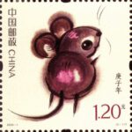
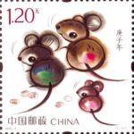
+ 1月16日 北京2022年冬奥会吉祥物和冬残奥会吉祥物 纪念 元  

+ 2月8日 中国剪纸（二） 特种 元  

+ 3月20日 吴冠中作品选 特种 元  

·特11-2020：4月7日5月11日特别 众志成城 抗击疫情  元  

+ 4月24日 中国第一颗人造地球卫星发射成功五十周年 纪念 元  

+ 5月15日 亚洲文明（一） 特种 元  

+ 5月17日 中国古典文学名著-〈红楼梦〉（四） 特种 元  

+ 5月20日 玫瑰 特种 元  

+ 5月25日 中国登山队登顶珠峰六十周年 纪念 元  

+ 6月1日 动画——葫芦兄弟 特种 元  

+ 6月6日 哈尔滨工业大学建校一百周年 纪念 元  

+ 6月18日 中华全国集邮联合会第八次代表大会 纪念邮票（小型张）1套1枚。
+ 6月21日 天文现象 特种 元  

+ 7月11日 故宫博物院（二） 特种 元  

+ 7月20日 新时代的浦东 特种 元  

+ 8月19日 华佗 特种 元  

+ 8月22日 <共产党宣言>中文全译本出版一百周年 纪念 元  

+ 9月19日 中国现代科学家（八） 纪念 元  

+ 9月26日 莫高窟 特种 元  

+ 9月26日 中国首次火星探测“天问一号”发射成功 纪念 元  

+ 10月18日 查干湖 特种 元  

+ 11月1日 第七次全国人口普查 纪念 元  

+ 10月25日 中国人民志愿军抗美援朝出国作战70周年 纪念 元  

+ 11月7日 北京2022年冬奥会——冰上运动 纪念 元  

+ 11月12日 海外民生工程 特种 元  

+ 11月24日 中埃建交五十周年 纪念 元  

+ 11月28日 恩格斯诞辰200周年 纪念 元  

### 2021年
+ 1月
    + 1日 <中华人民共和国民法典>施行 纪念 1.2元  
    
    + 5日 辛丑年 特种 2.4元  
    
    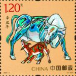
    + 10日 中国人民警察节 纪念 2.4元  
    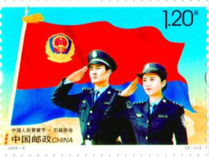
    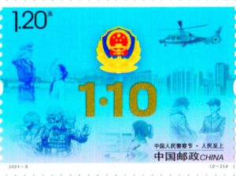
+ 3月
    + 20日 五牛图 特种 5.9元  
    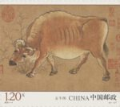
    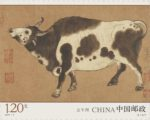
    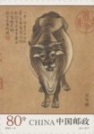
    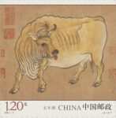
    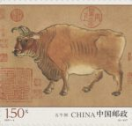
+ 4月
    + 6日 厦门大学建校一百周年 纪念 1.2元  
    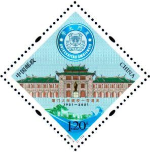
    + 17日 中国飞机（三） 特种 4.8元  
    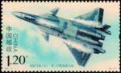
    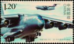
    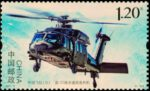
    
    + 23日 中国古典文学名著——〈西游记〉（四） 特种 4.8元  
    
    
    
    
+ 5月
    + 19日 福建土楼 特种 4.8元  
    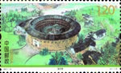
    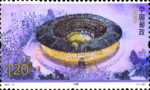
    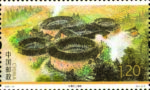
    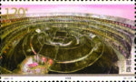
    + 21日 中巴建交七十周年 纪念 2.4元  
    
    
+ 6月
    + 1日 儿童画作品选 特种 3.2元  
    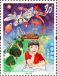
    
    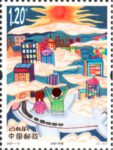
    + 12日 丝绸之路文物（二） 特种 4.8元  
    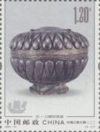
    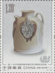
    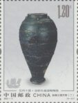
    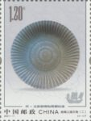
    + 20日 中国共产党历史展览馆 特种 1.2元  
    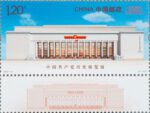
    + 23日 北京2022年冬奥会——竞赛场馆 纪念 4.8元  
    
    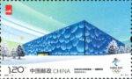
    
    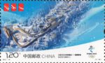
+ 7月
    + 1日 中国共产党成立100周年 纪念 24元  
    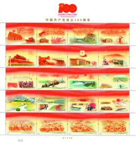
    + 23日 第三十二届奥林匹克运动会 纪念 2.4元  
    
    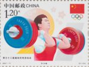
+ 8月
    + 19日 西藏和平解放70周年 纪念 1.2元  
    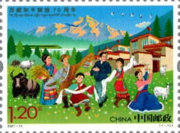
    + 28日 动画——哪吒闹海 特种 6.4元  
    
    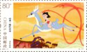
    
    
    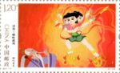
    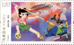
+ 9月
    + 7日 木芙蓉 特种 4.8元  
    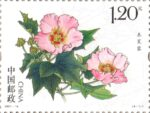
    
    
    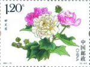
    + 15日 中华人民共和国第十四届运动会 纪念 2.4元  
    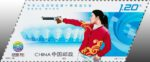
    
    + 25日 江山如此多娇 特种 小型张 6元  
    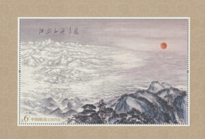
+ 10月
    + 10日 辛亥革命110周年 纪念 1.2元  
    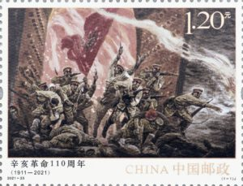
    + 11日 <生物多样性公约>第十五次缔约方大会 纪念 1.2元  
    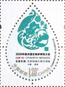
    + 15日 交通可持续发展 特种 4.8元  
    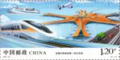
    
    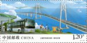
    
    + 15日 山东大学建校一百二十周年 纪念 1.2元  
    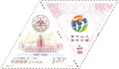
    + 18日 豫剧 特种 3.6元  
    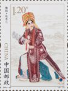
    
    
    + 25日 中华人民共和国恢复联合国合法席位50周年 纪念 1.2元 
    
+ 11月
    + 24日 科技创新（三） 纪念 元  
    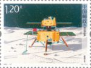
    
    
    
    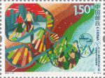
+ 12月
    + 3日 国家重点保护野生动物（I级）（三） 特种 9.1元  
    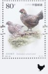
    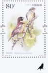
    
    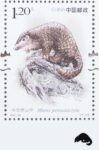
    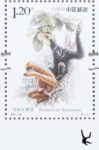
    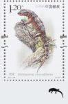
    
    
    + 11日 中伊建交50周年 纪念 2.4元  
    
    
### 2022年
+ 1月
    + 1日 区域全面经济伙伴关系协定生效 纪念 1.2元  
    
    + 5日 壬寅年 特种 2.4元  
    
    
+ 2月
    + 4日 第24届冬季奥林匹克运动会开幕纪念 纪念 2.4元  
    
    
    + 14日 中墨建交五十周年 纪念 2.4元  
    
    
+ 4月
    + 23日 中国古典文学名著——〈红楼梦〉（五） 特种 6元  
    
    
    
    
    + 28日 世界自然遗产——中国南方喀斯特 8.4元  特种 
    
    
    
    
    
    
    
+ 5月
    + 5日 中国共产主义青年团成立一百周年 2元 纪念 
    
    + 18日 姑苏繁华图 特种 7.2元  
    
    
    
    
    
    
    + 19日 中国古镇（四） 特种  4.8元  
    
    
    
    
    + 28日 洞庭湖 特种 4元  
    
    
    
    
+ 6月
    + 1日 我和祖国一起成长 特种 5.2元  
    
    
    
    
    
    + 6日 东南大学建校一百二十周年 纪念 1.2元  
    
